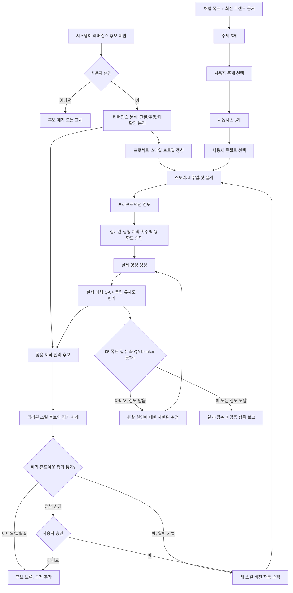

# 레퍼런스 기반 지속 학습·영상 제작 시스템 설계

> 상태: **설계 초안 — 사용자 검토 대기.** 상세 설계 작성 승인은 구현·실행·미디어 생성 승인이 아니다.
>
> 범위: 승인된 영상 레퍼런스에서 일반 제작 원리와 프로젝트별 스타일을 지속적으로 축적하고, 그 지식을 새 주제의 영상 제작 및 결과 평가에 연결하는 흐름.

## 1. 목표와 설계 판단

### 목표

사용자가 승인한 레퍼런스 영상과 실제 제작 결과에서 학습 근거를 계속 모은다. 여러 작업에 전이 가능한 제작 원리는 공용 스킬 개선 후보로 만들고, 브랜드·채널·시리즈의 고유 룩과 규칙은 프로젝트별 스타일 프로필로 보관한다. 이 지식을 사용해 채널 목표와 최신 트렌드에 맞는 새 영상 주제를 제안하고, 선택된 주제를 실제 영상으로 제작한다.

성공은 두 가지로 분리해 판단한다:

1. **프로젝트 성공:** 해당 결과가 승인된 레퍼런스 특성에 얼마나 가까운지, QA blocker가 있는지.
2. **학습 성공:** 후보 스킬이 새로운 평가 사례에서도 이전 버전보다 더 좋은 결과를 만들고 기존 능력을 퇴행시키지 않는지.

프로젝트의 영상 점수가 높다고 공용 스킬이 개선된 것은 아니다. 스킬 후보의 평가 통과가 현재 영상에 대한 사용자 수락을 뜻하지도 않는다.

### 확정된 사용자 의도

- 레퍼런스 기반 학습과 새 영상 제작을 모두 지원한다.
- 개선 결과는 공용 제작 원리와 프로젝트/브랜드별 스타일 지식으로 나눠 축적한다.
- 시스템이 레퍼런스 후보를 찾을 수 있지만, 분석 전 사용자가 승인한다.
- 주제 5개, 선택 주제의 시놉시스 5개를 제안한다. 주제는 채널/관객 적합성을 우선하고 최신 트렌드는 보조 근거로 사용한다.
- 유사도 평가 축: 편집·리듬·정보 공개 순서, 샷·구도·카메라, 시각 스타일, 사운드 설계, 감정·서사 효과.
- 95%는 요구사항 완료율이 아니라 레퍼런스 유사도 목표다. 판정은 가중 평균에 필수 축 하한을 결합한다.
- 사전 승인된 실행 횟수·비용 한도 안에서 비교·재시도를 자동 진행한다.
- 일반 제작 기법 개선은 검증 통과 후 자동 반영한다. 권리·안전·승인·비용 정책 변경은 사용자 승인을 요구한다.

### 제외 범위

- 권리가 확인되지 않은 제3자 캐릭터·대사·사건·브랜드·음원·고유 디자인의 복제.
- 사용자 승인 없는 레퍼런스 영상 분석 또는 학습 사용.
- 자동 게시·외부 공개.
- 승인된 실행 계획의 횟수·비용 상한을 넘는 생성·과금.
- 권리·안전·승인·비용 정책의 무승인 자동 변경.
- 모델 가중치의 파인튜닝/재학습. 이 설계의 “학습”은 버전이 있는 프로필, 스킬 지침 및 평가 사례의 개선을 뜻한다.
- 원본 비디오, 개인 프로젝트 산출물, 인증 정보의 공용 스킬 저장소 반입.

## 2. 책임 경계

`creative-production`은 프로젝트의 유일한 라우터로 유지한다. 기존 `project.json`이 프로젝트 산출물·승인·의존성·생성 시도·검사 상태의 canonical record다. 새 프로젝트 DB나 중복 승인 원장을 만들지 않는다.

| 책임 | 소유자 | 경계 |
|---|---|---|
| 레퍼런스 분해와 기존 스킬 대비 커버리지 | `video-production-assets/references/25-reference-video-analysis.md` | 관찰/추정/미확인을 구분하고 이전 가능한 제작 원리를 추출한다. 원본 표현의 재현 권한은 부여하지 않는다. |
| 주제부터 프리프로덕션까지 | `creative-production` → `orchestrating-video-preproduction` 및 필요한 전문 스킬 | 주제·시놉시스·캐릭터·스토리보드의 선택 상태와 사용자 체크포인트를 유지한다. 텍스트 기획은 미디어 생성이 아니다. |
| 프로젝트 제작물 QA와 인과 재시도 | `video-production-assets/references/12-qa.md`, `21-generated-video-qa-retry.md` | 실제 생성물만 평가하고, 실패 원인과 재검수 조건을 기록한다. |
| 실시간 모델/실행·비용 승인 | `video-production-assets/references/24-production-execution.md` 및 `preproduction-review.md` | 샷별 현재 기능·endpoint schema·가격·권리 조건을 확인하고, 승인 범위 내에서만 제출한다. |
| 전역 스킬 후보 평가·승격 | 저장소 버전 관리와 스킬 평가 사례; 가능한 환경에서는 `skill-creator` 절차 사용 | 격리된 후보를 평가한 뒤 저위험 제작 기법만 자동 승격한다. 운영 중인 스킬을 프로젝트 반복 도중 직접 덮어쓰지 않는다. |

기존 계약의 `artifacts`, `approval`, `dependency_versions`, `asset_registry`, `generation_attempts`, `issues`, `delivery_checks`를 사용한다. 새로운 데이터 요구가 확인되기 전에는 `project.json`의 병렬 필드나 새 manifest를 추가하지 않는다.

## 3. 데이터 구분과 출처

### 프로젝트/브랜드 프로필

버전이 있는 `style_profile` artifact로 해당 프로젝트/브랜드에서 승인한 레퍼런스와 스타일 결정을 기록한다. 최소 필드:

- profile ID, 버전, 적용 범위(프로젝트/브랜드/시리즈)
- 승인된 레퍼런스 ID와 출처/접근 근거
- 다섯 유사도 축별 관찰 규칙과 대표 타임코드/프레임/오디오 구간
- 각 규칙의 상태: 직접 관찰 / 해석 / 사용자 승인 / 미확인
- 적용 샷/산출물 ID, 제외할 요소, 유효 기간 또는 폐기 상태

한 브랜드의 룩, 캐릭터 연속성, 내부 표현 관례는 다른 브랜드의 공용 스킬 규칙으로 자동 승격하지 않는다. 다른 프로젝트에 재사용할 때는 프로필 범위를 명시적으로 연결하고, 출처·권한·적용 여부를 다시 확인한다.

### 공용 스킬 개선 후보

공용 후보는 제작 사례의 관찰과 근거가 연결된 저장소 변경으로 관리한다. 최소 정보:

- 영향을 받는 스킬/절차와 기존 버전
- 제안 규칙, 적용되는 조건과 명시적 예외
- 근거 artifact ID, 관찰 범위, 성공/실패 사례
- 후보 분류: 일반 제작 기법 또는 정책 규칙
- 기준 버전과 후보 버전의 평가 결과, 회귀/홀드아웃 결과
- 승격·거절·롤백 기록

원본 미디어는 프로젝트 소유 위치에 둔다. 공용 평가 자료에는 원본 비디오나 민감한 프로젝트 정보를 복사하지 않고, 사용 권한이 확인된 최소 사례 또는 출처를 추적할 수 있는 안전한 기술 요약만 쓴다. 이 저장소는 `README.md`에서 재사용 라이선스가 없다고 명시하므로, 외부 배포/재사용은 별도 권리 확인 없이는 하지 않는다.

### 프로젝트 artifact 유형

기존 artifact 구조 안에서 다음 역할의 산출물을 등록한다. 이는 현재 스키마에 이미 고정된 enum이라는 뜻이 아니다.

- `reference_analysis`: 승인된 원본, 실제 검사 범위, 시각/청각 관찰과 추정.
- `style_profile`: 프로젝트/브랜드별 승인된 제작 특성.
- `reference_match_report`: 생성된 실제 미디어의 축별 점수와 근거.
- `skill_evaluation`: 공용 후보 변경과 평가 사례/결과의 연결 정보. 프로젝트 원장에는 연결 artifact ID만 남기고 전역 평가 자료는 저장소 버전 관리에 둔다.

## 4. 전체 흐름

두 루프는 연결되어 있다. 각 프로젝트의 QA 결과는 개선 근거가 되지만, 해당 결과가 격리된 후보 평가를 통과하기 전에는 공용 스킬 버전을 바꾸지 않는다. 이미 진행 중인 프로젝트는 시작 당시의 공용 스킬/프로필 버전을 고정하며, 변경된 버전을 다음 프로젝트부터 사용한다.

## 5. 레퍼런스 학습 경로

1. 시스템은 사용자 목적에 맞는 후보와 근거(출처, 게시 시점, 길이, 형식 등)를 제안한다. 후보 발견은 분석 승인이 아니다.
2. 사용자는 분석할 영상 범위를 승인한다. 승인되지 않은 영상은 열어 보거나 외부 도구에 보내지 않는다.
3. `25-reference-video-analysis`로 샷/비트와 동작·카메라·편집·소리를 분석한다. 전체를 보지 않았거나 오디오를 듣지 않았으면 그 범위를 명시한다.
4. 분석 결과에서 프로젝트/브랜드 프로필과 공용 제작 원리 후보를 분리한다. 보호되는 구체 표현을 일반 규칙으로 위장하지 않는다.
5. 공용 후보를 격리된 작업 상태에서 기존 스킬과 비교한다. 한 단일 사례에서 나온 수정은 후보일 수 있지만, 그 사례만으로 승격하지 않는다.
6. 기준 스킬과 후보 스킬을 동일한 고정 사례 및 별도의 홀드아웃 사례로 평가한다. 후보는 대상 문제를 개선하고, 기존 핵심 능력에 blocker급 퇴행이 없어야 한다. 평가 증거가 불충분하거나 evaluator의 불확실성이 크면 자동 승격하지 않는다.
7. 일반 제작 기법은 위 기준을 통과하면 새 버전으로 자동 반영한다. 권리·안전·승인·비용 규칙을 바꾸는 후보는 평가 통과만으로 반영하지 않고 사용자 승인을 기다린다.
8. 버전·변경 이유·평가 사례·결과를 보존한다. 배포 후 회귀가 발견되면 직전 정상 버전으로 되돌릴 수 있어야 한다.

“계속 개선”은 **각 제작 결과를 개선 증거로 계속 접수하고**, 충분히 검증된 변경을 자동 승격한다는 뜻이다. 모든 출력마다 공용 스킬 문장을 즉시 덮어쓴다는 뜻은 아니다.

## 6. 새 콘텐츠 기획·제작 경로

1. **주제 탐색:** 채널/브랜드 목표, 관객, 금지/고정 조건을 브리프에서 가져온다. 트렌드 조사 결과는 출처와 확인 시점을 붙이며 성과 보장으로 표현하지 않는다. 레퍼런스의 주제 복사 대신 제작 특성을 활용한다.
2. **주제 선택:** 서로 다른 방향의 후보 5개를 제안하고 사용자가 선택한다. 사용자가 주제를 이미 제공했다면 자동으로 다른 주제 목록을 끼워 넣지 않는다.
3. **시놉시스 선택:** 선택된 주제에 대한 시놉시스 5개를 제안한다. 선택한 시놉시스/콘셉트가 이후 산출물의 spine이 된다.
4. **조건부 프리프로덕션:** 캐릭터·비주얼 모드·비주얼 바이블·스토리보드 패널을 필요한 범위에서 작성한다. 스토리보드 패널은 이야기/정보 비트이며 생성 샷·샷 타이밍과 다르다. 카메라 수치, VFX, Blender 프리비즈는 요구가 있을 때 해당 스킬로 라우팅한다.
5. **오디오 계획:** 03 screenplay와 22 dialogue/lipsync로 대사·VO·화면 내 화자를 구분한다. 실제 화면 내 발화가 요구되지 않으면 립싱크를 강제하지 않는다. BGM은 필요한 경우에만 선정하고 트랙별 라이선스/이용범위를 확인한다.
6. **생성 경로:** 프리프로덕션 후 `24-production-execution`에서 샷별 hard 요구에 맞춰 현재 endpoint, schema, 지원 기능, 가격, 약관을 확인한다. 영상/음성 모델을 고정 기본값으로 만들지 않는다.
7. **사용자 검토와 승인:** 사용자는 프리프로덕션 버전을 검토한다. 실행 계획에는 선택 모델/endpoint, 샷 범위, 출력 수, 생성 재시도 수, 시간 및 비용 상한, 납품 조건을 넣고 별도 실행 승인을 받는다. 승인된 범위 밖 실행은 중단한다.
8. **실제 생성과 QA:** 실제 결과 파일만 검사한다. 정상 속도/무음/문제 구간/오디오 등 해당 검사 모드를 기록하고, 미검증 항목을 pass 처리하지 않는다.
9. **수정 또는 완료:** 결과가 유사도/QA 기준을 통과하면 완료 후보로 보고한다. 한도가 남았으면 QA 관찰에 대응하는 주요 변수 하나만 바꿔 재시도한다. 끝나면 사용자에게 결과 파일, 축별 점수, 차이, 실제 검증 범위, 미검증 항목을 제공한다. 사용자 수락과 게시 권한은 각각 별도다.

## 7. 유사도 점수와 통과 규칙

### 점수 항목

실제 reference와 결과물의 비교 대상은 아래 다섯 축이다. 평가자는 생성 프롬프트가 아니라 실제 생성 영상/오디오와 승인된 레퍼런스를 비교한다.

| 축 | 비교할 관찰 항목 예시 |
|---|---|
| 편집·리듬·정보 공개 | 컷/전환의 기능, 길이 패턴, 훅·전개·보상의 순서와 타이밍 |
| 샷·구도·카메라 | 샷 크기 변화, 프레이밍, 화면 내 배치, 카메라 동작의 종류/동기 |
| 시각 스타일 | 팔레트, 조명, 질감, 그래픽 밀도, 장면 간 룩 일관성 |
| 사운드 설계 | 대사/효과/음악/침묵의 역할, 밀도, 주요 싱크와 믹스 관계 |
| 감정·서사 효과 | 긴장/유머/놀라움/여운의 기능과 전환. 구체 사건·대사를 복제하지 않음 |

축 점수 `s_i`는 0–100 루브릭 점수, 가중치 `w_i`의 합은 1이다. 전체 점수는 `S = Σ(w_i × s_i)`로 계산한다. 초기 기본 가중치는 각 축 0.2이며, 프로젝트에서 다르게 정하면 승인된 brief/profile에 기록한다.

**통과 조건:** `S ≥ 95`, 프로젝트에서 필수로 표시한 각 축이 해당 하한 이상, 적용 가능한 QA에 열린 blocker가 없고, 필수 비교 범위가 실제로 검사됐을 때만 pass로 판정한다. 적용할 수 없는 축은 이유와 함께 N/A로 두고 나머지 가중치를 재정규화한다. 검사할 영상/오디오가 없거나 핵심 구간을 보지 못했으면 점수 pass가 아니라 unverified다.

95는 아직 검증된 객관적 사실이 아니다. 초기에는 독립 evaluator의 루브릭 추정치로 표시한다. 실제 pass/stop 자동화 전에 서로 다른 레퍼런스와 장르의 사람 평가 기준 사례로 evaluator 편향·일관성을 보정한다. 보정에 실패하면 수치 자동 판정은 중지하고 축별 근거를 사용자에게 보여준다.

### 평가 절차

- 영상 생성 역할과 점수 판정 역할을 분리한다. 평가자의 버전/모델/루브릭을 보고서에 기록한다.
- 각 축은 점수, 근거가 되는 타임코드/프레임/오디오 구간, 신뢰도, 실패/미검증 항목을 함께 반환한다.
- 숫자만으로 보호 표현의 복제 정도를 평가하지 않는다. 레퍼런스의 사용 권한과 스타일 비교 권한은 별도 확인한다.
- 독립 evaluator가 필요할 때 실제 media를 받지 못했다면 자동 재시도를 유도하는 pass/fail 대신 unverified로 반환한다.

## 8. 자동 반복, 중단, 승인

각 실제 생성은 승인된 `video_execution_plan`의 범위 안에서만 이뤄진다. 계획은 샷/출력 수, 최대 시도, 현재 가격과 총비용 상한, 시간 제한, 선택 경로와 재검수 기준을 담는다. **한도 설정이 없거나 가격이 불명확하면 유료 제출을 시작하지 않는다.**

각 시도는 실제 `generation_attempts`로 기록한다. 평가에서 발견한 문제는 `21-generated-video-qa-retry`의 실패 분류에 따라 가장 이른 통제 가능한 원인을 고치고, 한 번에 하나의 주요 변수를 바꾼다.

반복은 다음 조건에서 정지한다:

1. 유사도 목표와 필수 축 하한을 넘고 QA blocker가 해결됨.
2. 승인된 재시도/비용/시간 한도에 도달함.
3. 같은 원인으로 개선이 없거나 해당 문제를 실제로 평가할 수 없음.
4. 권리·기능·가격·사용자 승인 관련 blocker 발생.

한도 도달 후 추가 시도, 더 비싼 모델로 전환, 추가 출력, 게시를 자동으로 선택하지 않는다. 결과와 근거를 요약해 사용자에게 다음 선택을 요청한다. 프리뷰 승인도 최종 생성 승인으로 확장하지 않는다.

## 9. 통합 표면과 변경 범위 제안

첫 구현에서의 예상 변경 표면은 기존 소유자를 확장하는 최소 범위다. 아래는 설계안이며 아직 변경하지 않았다.

1. `creative-production/SKILL.md`: 승인된 레퍼런스 학습과 새 영상 제작을 연결하는 선택적 route, 프로필/스킬 후보 소유자 경계를 추가.
2. `video-production-assets/references/25-reference-video-analysis.md`: 관찰 산출물과 프로젝트 프로필/공용 제작 원리 후보를 분리하는 handoff를 보완.
3. `video-production-assets/assets/`: style-profile 및 축별 reference-match report 템플릿 추가 검토.
4. `video-production-assets/references/contract.md`: 새로운 필드나 DB는 추가하지 않고, 기존 artifact/dependency/approval 방식으로 위 산출물을 연결할 수 있는지 먼저 확인.
5. `creative-production/evals/`: 레퍼런스 승인, 프로필 범위 오염 방지, 축별 비교, 정책 변경 승인을 확인하는 평가 사례 추가. 실제 영상 품질 평가는 텍스트 출력 평가만으로 대체하지 않음.
6. `24-production-execution.md`와 `21-generated-video-qa-retry.md`: 기존 실시간 기능/가격/승인/상한/재시도 규칙을 재사용. 별도 실행기나 새 전역 coordinator를 추가하지 않음.

원본 영상·사용자 프로젝트·private style profile을 공용 스킬 패키지에 복사하지 않는다. 저장소는 재사용 라이선스가 없으므로, 공개 배포·외부 재사용을 이 작업에 포함하지 않는다.

## 10. 검증 기준과 단계적 활성화

### 필수 행위 평가 사례

- 미승인 reference 후보는 열람·분석·생성 입력으로 사용되지 않는다.
- 승인된 레퍼런스라도 관찰하지 않은 전체 구간/오디오에 대한 주장을 만들지 않는다.
- 공용 제작 원리와 브랜드별 규칙이 다른 artifact/version 경계에 남는다.
- 새 주제/시놉시스 제안은 각각 정확히 5개이며 근거와 선택 상태를 보존한다.
- 캐릭터·내레이션·립싱크·BGM·Blender 등 비적용 단계를 강제하지 않는다.
- 영상 모델/음성 도구/가격이 확인되지 않으면 실행 대신 준비 산출물과 blocker를 보고한다.
- 계획 밖 재시도/과금/게시가 발생하지 않는다.
- 점수 산출은 실제 media와 승인된 rubric/version이 있을 때만 한다. N/A/unverified와 blocker가 숨겨지지 않는다.
- 공용 스킬 후보의 자동 승격은 고정 회귀 사례와 별도 홀드아웃 사례를 통과한 일반 제작 기법으로 제한된다. 정책 변경은 승인을 기다린다.
- 입력 버전 변경 시 영향받는 profile/match report/execution plan만 stale 처리되고 이전 승인은 새 버전에 재사용되지 않는다.
- 활성 스킬 버전과 후보 버전, 평가 근거, rollback 대상으로 돌아갈 수 있는 직전 정상 버전을 추적할 수 있다.

### 활성화 순서

1. **Shadow scoring:** 승인된 사례에서 축별 평가를 실행하되 자동 pass 판정과 스킬 자동 승격은 끈다. 사람 평가와 비교해 rubric/evaluator를 보정한다.
2. **검증된 스킬 승격:** 회귀/홀드아웃 평가가 안정적일 때 일반 제작 기법의 격리 후보를 자동 승격하고, 모든 변경에 버전/평가/롤백 기록을 남긴다. 권리·안전·승인·비용 정책은 사용자 검토 전까지 승격하지 않는다.
3. **한도 내 자동 제작 반복:** 유사도 점수와 필수 축 하한이 해당 평가 유형에서 충분히 보정된 뒤에만 자동 생성/재시도 게이트를 켠다. 그 전에는 자동 점수에 따라 추가 유료 시도를 시작하지 않는다.

이 순서는 지속 학습을 늦추기 위한 대기가 아니다. 첫 단계부터 evidence/profile을 축적하고, 검증되지 않은 수치나 skill patch가 운영 결과를 오염시키는 것만 막는다.

## 11. 남은 프로젝트별 입력

공용 설계에서 고정하지 않고 각 제작 brief 또는 승인 계획에서 정한다:

- 적용할 style profile과 참조 영상 버전.
- 참조 유사도 축별 가중치와 필수 축 하한. 프로젝트에서 정하지 않으면 기본 가중치 동일 적용; 필수 축은 승인 시 지정.
- 실제 영상 길이/화면비/플랫폼/납품 규격.
- 허용된 실행자, 시도 수, 시간 및 비용 상한.
- 목표 audience와 채널/브랜드, 최신 트렌드 조사의 범위.
- 사용 가능한 캐릭터/음성/음악/브랜드 에셋과 해당 이용 권한.

## 12. 근거가 된 현재 계약

- `creative-production/SKILL.md`: 단일 조정자, 요청 범위, 프리프로덕션/실행 승인 분리, 실시간 모델·비용 확인.
- `video-production-assets/references/25-reference-video-analysis.md`: reference 분석, 관찰/추정 구분, 이전 가능한 원리와 스킬 coverage/gap 검토.
- `video-production-assets/references/preproduction-review.md` 및 `contract.md`: 프로젝트 artifact, version-bound approvals/dependencies, execution plan과 실제 user authorization.
- `video-production-assets/references/21-generated-video-qa-retry.md`: 실제 미디어 QA, 관찰 기반 수리, 제한된 재시도, 시도 이력.
- `video-production-assets/references/24-production-execution.md`: 현재 모델/endpoint/가격 확인, 비용 계층, 프리뷰·최종 실행 승인과 상한.
- `orchestrating-video-preproduction/SKILL.md`, `developing-video-synopses/SKILL.md`, `designing-video-character-sheets/SKILL.md`, `storyboarding-video/SKILL.md`: 방향 선택, 적용 가능한 텍스트 기획, 선택 체크포인트.
- `README.md`: 현재 저장소에 재사용 라이선스가 없으며, 기존 구조 검사가 실제 영상 품질·권리·제공자 기능을 증명하지 않음.
